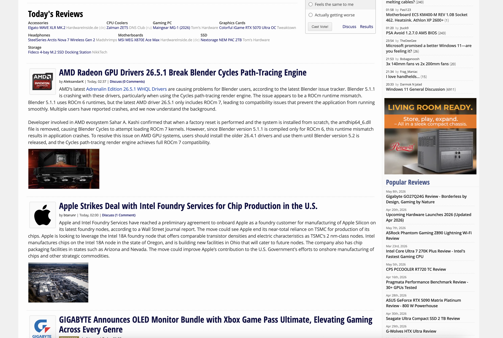
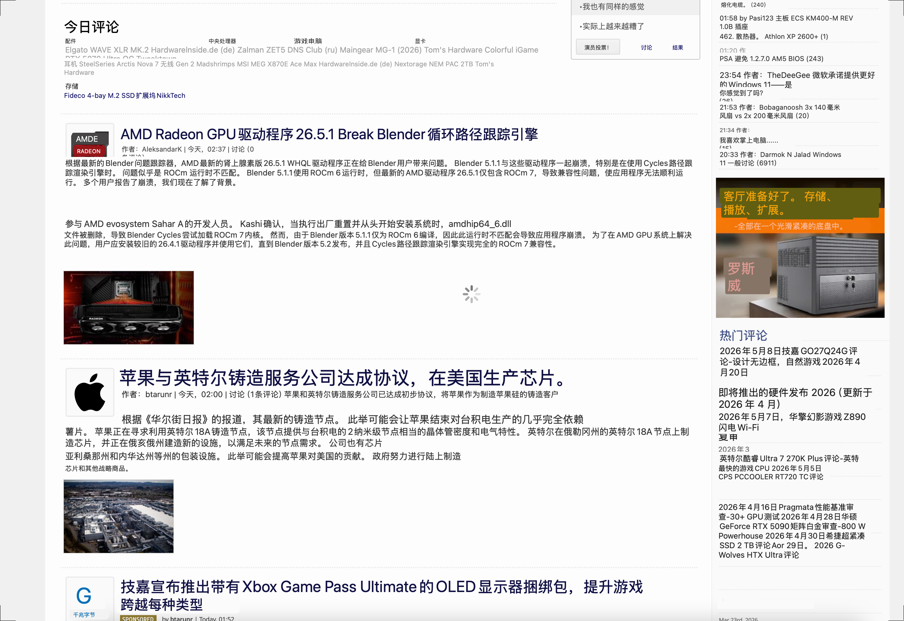
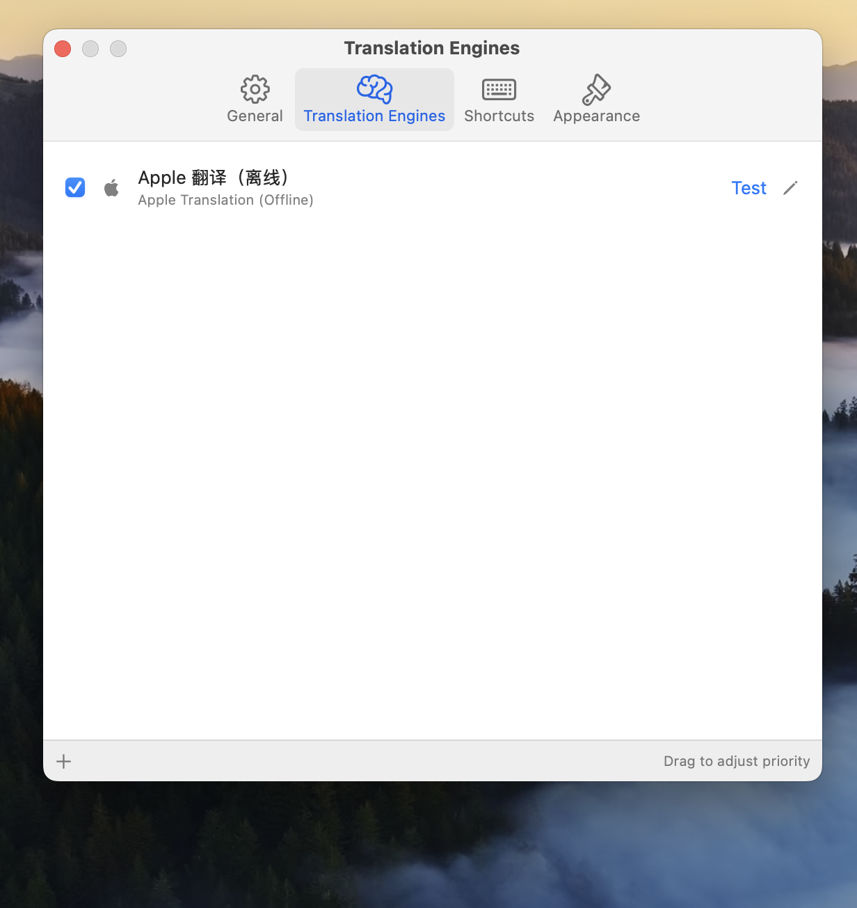
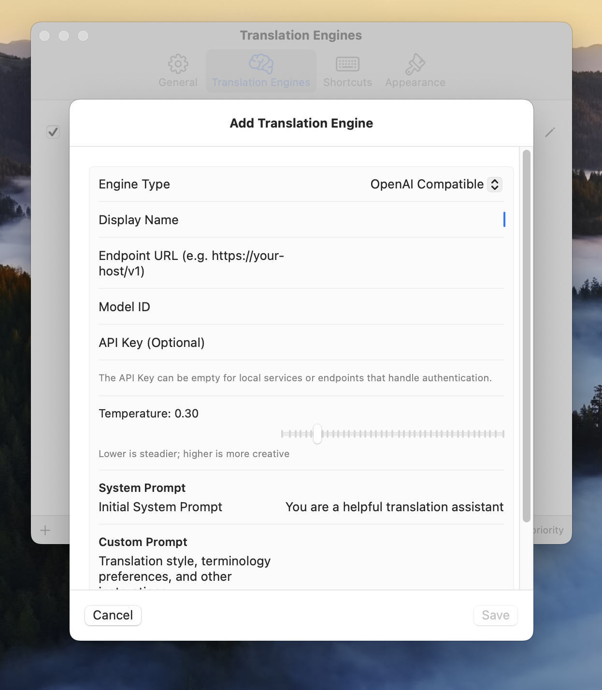
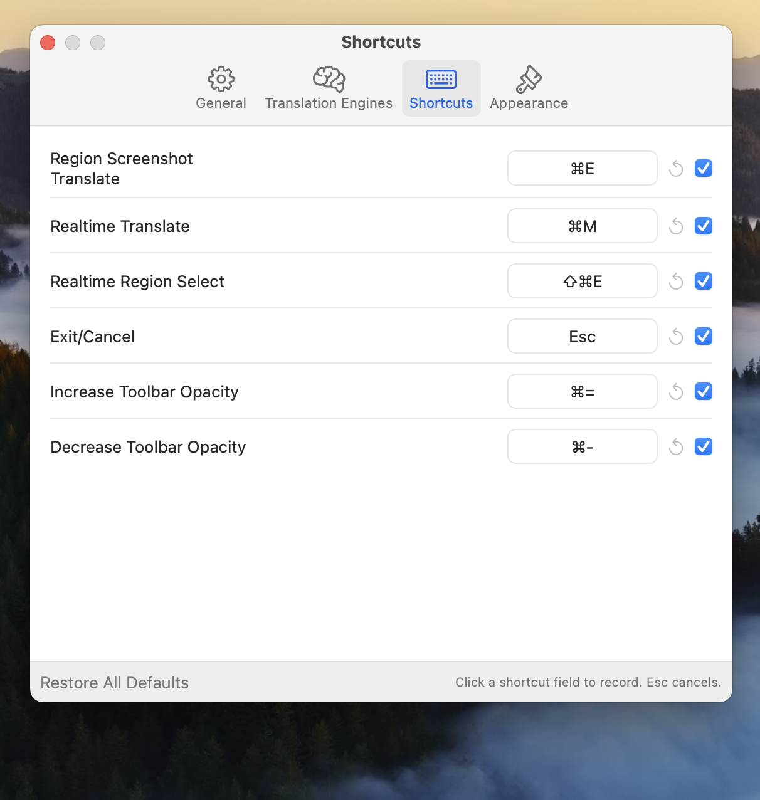
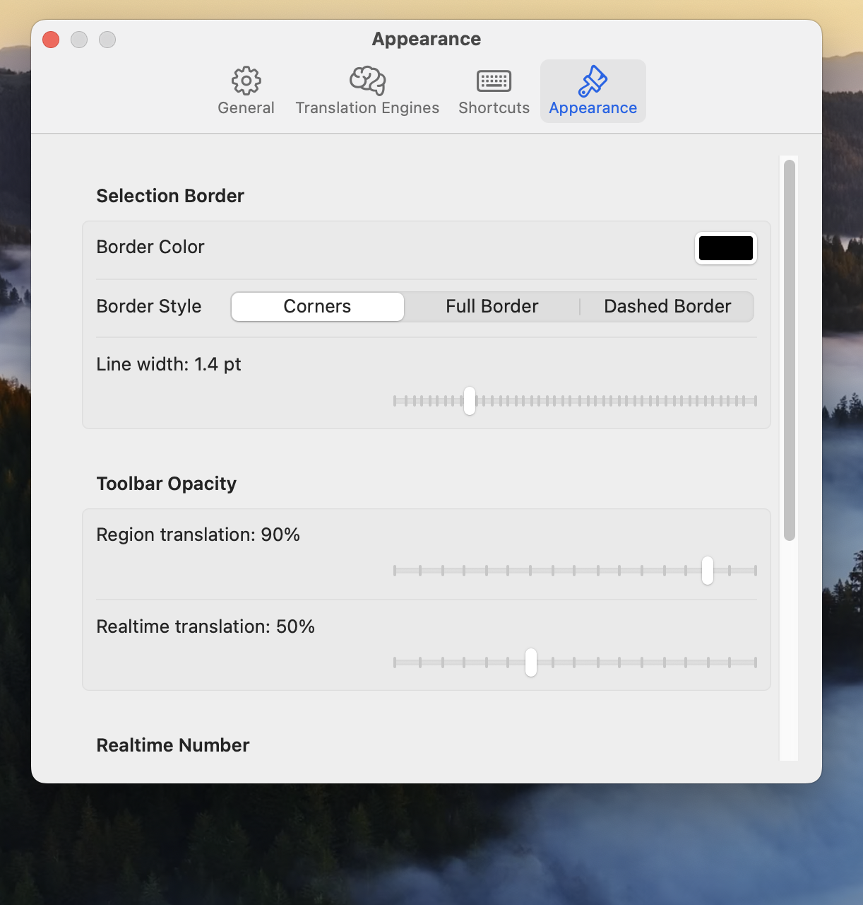
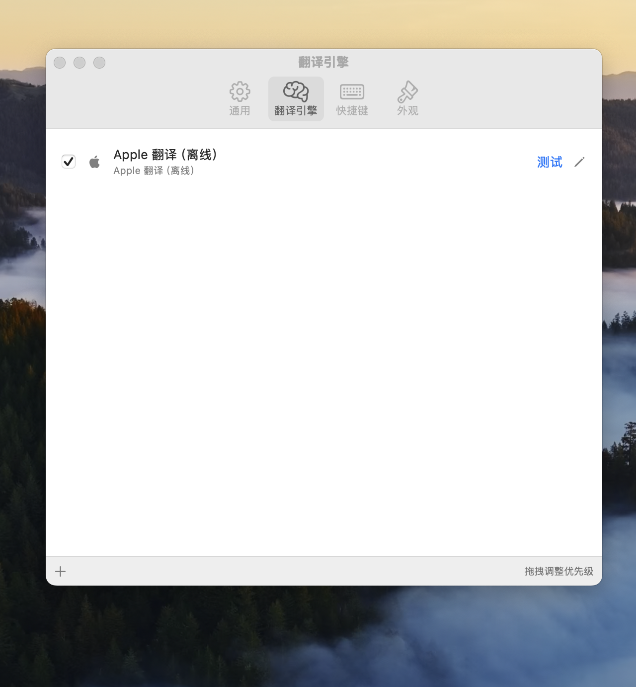
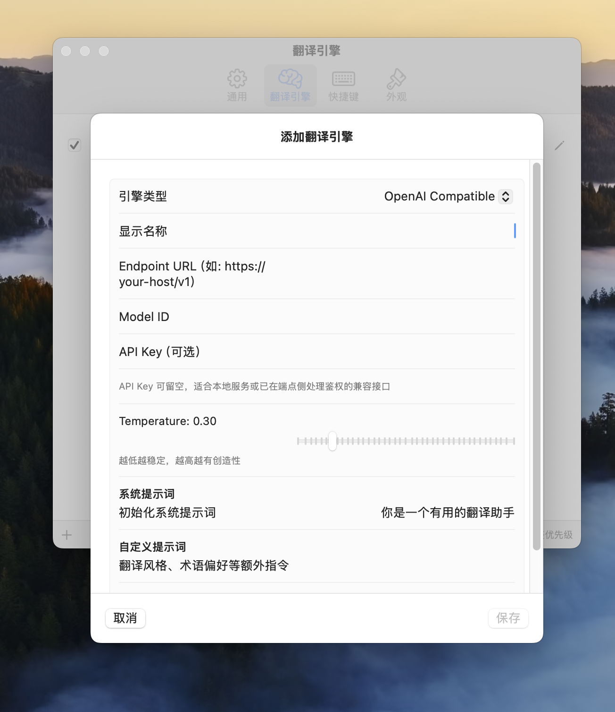
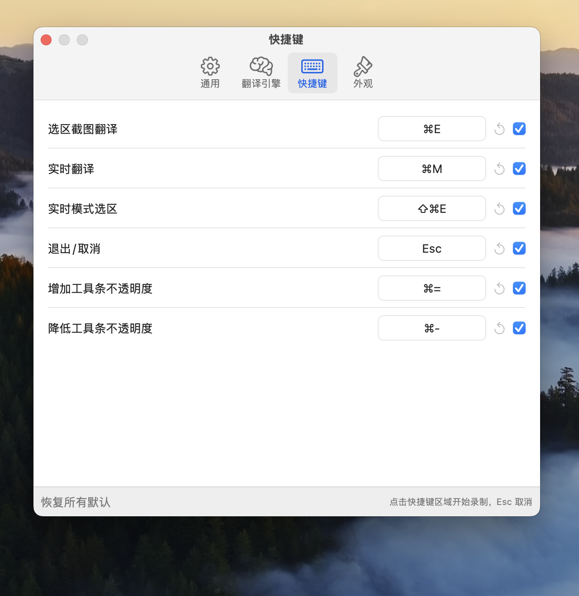
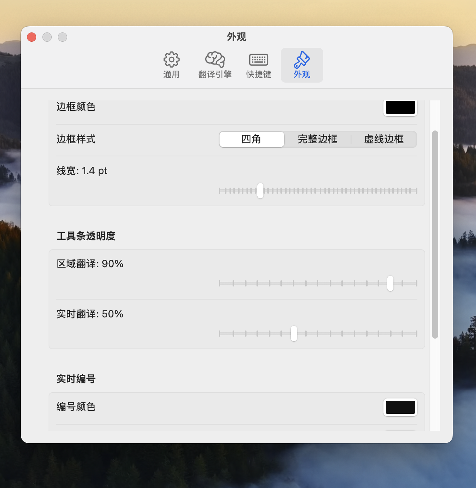

<p align="center">
  
</p>

<h1 align="center">TranScreen</h1>

<p align="center">
  <strong>悬浮在屏幕上的 macOS 翻译工具</strong><br>
  <strong>A macOS screen translation tool that stays out of your way</strong>
</p>

<p align="center">
  
  
  
  
  
</p>

<p align="center">
  <a href="#english">English</a> | <a href="#中文">中文</a>
</p>

---

## English

`TranScreen` is a macOS menu bar screen translation app. It lets you select an area of the screen, run OCR, translate the detected text, and display the translation directly as an overlay.

TranScreen supports one-shot region translation and realtime translation regions. It is useful for foreign-language webpages, documents, images, video subtitles, game text, and any screen content that cannot be copied directly.

> TranScreen is still evolving. This README focuses on the current core experience; packaged releases, screenshots, and demo assets will be added over time.

## Features

- **Region translation**: press a shortcut, drag a screen area, then translate the detected text.
- **Realtime translation regions**: create persistent translation regions on screen, with support for up to 8 regions.
- **Apple Vision OCR**: recognize text from screenshots, images, videos, and app UIs.
- **Overlay translation**: show translated text directly on top of the current screen.
- **Multiple translation engines**: Apple Translation, OpenAI-compatible, Anthropic-compatible, Google-compatible, DeepL, and Ollama.
- **Custom hotkeys**: configure shortcuts for translation, realtime mode, exit, and toolbar opacity.
- **Preferences**: configure source and target languages, realtime scan interval, selection border, toolbar opacity, and realtime badge style.
- **Menu bar first**: no Dock icon; TranScreen stays quietly available from the macOS menu bar.

## Screenshots

### Overlay Translation

| Before | After |
|---|---|
|  |  |

### Preferences

| Translation engines | Engine configuration |
|---|---|
|  |  |

| Hotkeys | Appearance |
|---|---|
|  |  |

### Demo GIFs Coming Soon

The static screenshots are already available. Two short GIF demos are still planned:

| Path | What to show |
|---|---|
| `docs/images/demo-region-translate.gif` | Press `⌘E`, drag a region, and show the translated overlay. |
| `docs/images/demo-realtime-translate.gif` | Create one or more realtime regions and show automatic translation refresh. |

## Installation

### Build From Source

Building from source is currently the recommended way to run TranScreen.

```bash
git clone <your TranScreen repository URL>
cd TranScreen
open TranScreen.xcodeproj
```

Then in Xcode:

1. Select the `TranScreen` target.
2. Run on macOS 15.0 or later.
3. Click Run to build and launch the app.
4. Grant **Screen Recording** and **Accessibility** permissions when macOS asks.
5. Restart TranScreen if screenshot capture or global hotkeys do not work immediately after permission changes.

### GitHub Release

Coming soon. Future releases can provide a signed `.dmg` or `.zip` package from GitHub Releases.

## Usage

| Action | Default shortcut | Description |
|---|---:|---|
| Region translation | `⌘E` | Select a screen area; TranScreen captures, recognizes, translates, and displays the result. |
| Realtime translation | `⌘M` | Enter realtime region selection mode and create a continuously refreshed translation overlay. |
| Add realtime region | `⌘⇧E` | Add another translation region while realtime mode is active. |
| Exit or cancel | `Esc` | Exit selection, realtime overlays, or the current translation state. |
| Increase toolbar opacity | `⌘=` | Make region and realtime toolbars more opaque. |
| Decrease toolbar opacity | `⌘-` | Make region and realtime toolbars more transparent. |

All shortcuts can be changed in Preferences.

## Permissions

TranScreen needs these macOS permissions:

- **Screen Recording**: captures the selected screen region for OCR.
- **Accessibility**: registers global hotkeys so TranScreen can respond while other apps are active.

TranScreen is a menu bar app. Use the menu bar icon to start translation, open Preferences, or quit.

## Build Requirements

- macOS 15.0+
- Xcode 26.0 compatible project format
- Swift 6.0

Core features are built on system frameworks, including SwiftUI, AppKit, ScreenCaptureKit, Vision, Translation, and SwiftData.

## License

TranScreen is licensed under the [GNU General Public License v3.0](./LICENSE).

---

## 中文

`TranScreen` 是一个 macOS 菜单栏屏幕翻译工具。它可以在不打断当前工作流的情况下，对屏幕选区进行 OCR 识别、翻译，并把译文直接叠加显示在原位置附近。

TranScreen 支持选区截图翻译和实时区域翻译，适合阅读外文网页、文档、图片、视频字幕、游戏文本或任何无法直接复制的屏幕内容。

> TranScreen is still evolving. 当前 README 按已具备的核心能力编写；打包发布、更多演示图和发布页会逐步补齐。

## 功能特性

- **选区截图翻译**：按下快捷键，拖拽屏幕区域，识别并翻译其中的文字。
- **实时区域翻译**：为屏幕上的固定区域创建实时翻译窗口，支持最多 8 个区域。
- **系统级 OCR**：基于 Apple Vision 进行文字识别，适合处理无法复制的图片、视频和应用界面文本。
- **悬浮译文叠加**：译文直接显示在屏幕覆盖层中，不需要切换应用。
- **多翻译引擎**：支持 Apple Translation、OpenAI-compatible、Anthropic-compatible、Google-compatible、DeepL 和 Ollama。
- **可自定义快捷键**：支持修改选区翻译、实时翻译、退出、透明度调整等动作的快捷键。
- **偏好设置**：可配置源语言、目标语言、实时扫描间隔、选区边框、工具条透明度和实时区域编号样式。
- **菜单栏常驻**：无 Dock 图标，适合长期在后台待命。

## 截图

### 译文叠加

| 翻译前 | 翻译后 |
|---|---|
|  |  |

### 偏好设置

| 翻译引擎 | 引擎配置 |
|---|---|
|  |  |

| 快捷键 | 外观 |
|---|---|
|  |  |

### 演示 GIF 待补充

静态截图已经可用，后续还可以继续补充两个短 GIF：

| 文件路径 | 建议内容 |
|---|---|
| `docs/images/demo-region-translate.gif` | 展示按下 `⌘E`、拖拽选区、出现译文覆盖层的完整流程。 |
| `docs/images/demo-realtime-translate.gif` | 展示创建一个或多个实时区域，并自动刷新译文。 |

## 安装

### 从源码构建

目前推荐从源码构建运行。

```bash
git clone <your TranScreen repository URL>
cd TranScreen
open TranScreen.xcodeproj
```

然后在 Xcode 中：

1. 选择 `TranScreen` target。
2. 使用 macOS 15.0 或更高版本运行。
3. 点击 Run 构建并启动应用。
4. 首次使用时，根据系统提示授予 **Screen Recording** 和 **Accessibility** 权限。
5. 如果授权后快捷键或截图仍不可用，请重新启动 TranScreen。

### GitHub Release

Coming soon. 后续可以在 GitHub Releases 中提供已签名的 `.dmg` 或 `.zip` 安装包。

## 使用方式

| 操作 | 默认快捷键 | 说明 |
|---|---:|---|
| 选区截图翻译 | `⌘E` | 拖拽选择屏幕区域，TranScreen 会截图、OCR、翻译并显示译文。 |
| 实时翻译 | `⌘M` | 进入实时区域选择模式，为固定区域创建持续刷新的翻译覆盖层。 |
| 实时模式添加选区 | `⌘⇧E` | 在实时翻译过程中继续添加新的翻译区域。 |
| 退出或取消 | `Esc` | 退出选区、实时覆盖层或当前翻译状态。 |
| 增加工具条不透明度 | `⌘=` | 提高区域工具条和实时工具条的不透明度。 |
| 降低工具条不透明度 | `⌘-` | 降低区域工具条和实时工具条的不透明度。 |

所有快捷键都可以在偏好设置中调整。

## 权限说明

TranScreen 需要以下 macOS 权限：

- **Screen Recording**：用于截取你选中的屏幕区域并进行 OCR。
- **Accessibility**：用于注册全局快捷键，让 TranScreen 可以在其他应用前台时响应操作。

TranScreen 是菜单栏应用。启动后可以从菜单栏图标打开翻译、设置和退出操作。

## 构建要求

- macOS 15.0+
- Xcode 26.0 compatible project format
- Swift 6.0

核心功能使用系统框架实现，包括 SwiftUI、AppKit、ScreenCaptureKit、Vision、Translation 和 SwiftData。

## License

TranScreen is licensed under the [GNU General Public License v3.0](./LICENSE).
